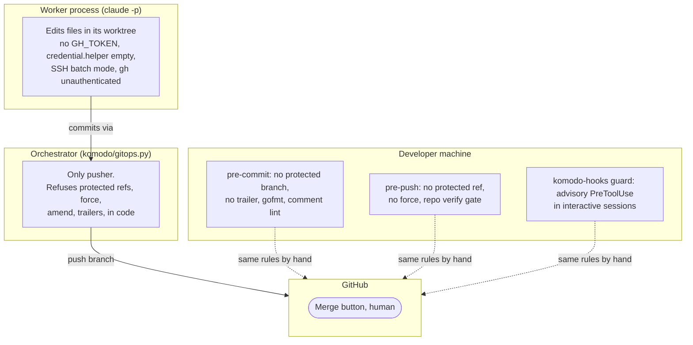

# komodo-agentic-toolkit-coding

A software assembly line for Komodo repos. Feed it a task group from `BACKLOG.md`, and it plans waves, builds them in parallel worktrees, verifies, reviews once, and opens a pull request. A human merges.

Three ideas hold it together:

1. **The pipeline is code.** A stdlib-only Python orchestrator owns the state machine. Models are workers that receive one brief and return JSON. No model reads the queue or decides the order.
2. **Guarantees are structural.** Workers hold no push credential. One module pushes, and it refuses protected refs in code. Git hooks refuse the same on the developer's machine.
3. **Context is per worker.** A builder sees its task, its files, the standard for its language, and its acceptance commands. Nothing else. Fixed prompt text stays under 1.5k tokens; the orchestrator itself spends none.

## Setup

Requirements: Python 3.9+, git, the `claude` CLI on PATH, and `gh` authenticated. Ollama is optional.

```bash
git clone <this repo> ~/komodo/ai/komodo-agentic-toolkit-coding
cd ~/komodo/ai/komodo-agentic-toolkit-coding
python3 -m komodo install                    # renders the claude adapter into ~/.claude, generates settings.json
python3 -m komodo hooks install ~/komodo/*/* # points each repo's git hooks at komodo/hooks
```

Windows: same commands with `python` or `py -3`. No Git Bash, no symlinks, no `make`. See [docs/windows-install.md](docs/windows-install.md).

The install is a copy. After editing `komodo/rules`, `roles`, `standards`, or `adapters`, run `python3 -m komodo install` again.

## Usage

In any repo with a `BACKLOG.md` in the [task grammar](komodo/rules/backlog.md):

```bash
python3 -m komodo run --dry-run              # plan: waves, briefs, token estimates, no spend
python3 -m komodo run TG-01.2                # run one group, fast profile
python3 -m komodo run TG-01.2 --profile thinking
python3 -m komodo status --prune             # runs, stale worktrees, merged branches
python3 -m komodo pr respond                 # answer unresolved review threads
python3 -m komodo pr sync                    # merge the base in, resolve conflicts with a worker
```

A run reports to `.komodo/runs/<id>/report.md` and into the PR body: what landed, what blocked, per-phase time, per-role cost.

## The pipeline


| Phase | Runs as | Model calls |
|---|---|---|
| Preflight, branch, DAG | code | 0 |
| Build | one builder per task, parallel by directory | N |
| Verify, compile gates | code | 0, +1 repair on failure |
| Review | one reviewer over the group diff | 1 |
| Publish, report | code and `gh` | 0 |

Roles declare a tier (`light`, `standard`, `heavy`). Profiles map tiers to a provider, model, and effort. Three ship as defaults in `komodo/config.py`; `komodo.json` and `.komodo/local.json` override them:

| Profile | light | standard | heavy | For |
|---|---|---|---|---|
| `fast` | Haiku low | Sonnet medium, $2 cap | Sonnet medium; review skipped under 150 diff lines | Pro plans, small groups |
| `thinking` | Haiku low | Sonnet high | Opus high | Max plans, hard groups |
| `local` | Ollama | Ollama | Ollama | Air-gapped use; summarize and review today, build once a tool-capable local runtime exists |

## Enforcement layers



The remote is the only place a change lands into `main`, and only a person presses that button.

## Layout

```
komodo/                the library and the orchestrator (stdlib only)
├── rules/             AGENTS.md (universal rules), backlog.md (grammar), cli.md (commands)
├── roles/             one file per role: tier, access, and the body every renderer uses
├── standards/         rule files per language and domain, injected by extension
├── briefs/            worker prompt template per role
├── adapters/claude/   renders ~/.claude from the above; owns its hooks and settings policy
│   └── hooks/         guard.py, context_injector.py, the Go source in src/, prebuilt binaries in bin/
├── hooks/             pre-commit.py, pre-push.py, and the sh stubs Git runs
├── workers/           claude (headless CLI) and ollama adapters
├── pipeline.py        the phases
├── gitops.py          the only git writer
└── __main__.py        CLI: run, status, tasks, comments, hooks, install, doctor, pr, release
tests/                 unittest suites
scripts/verify.py      the gate this repo runs
templates/project/     AGENTS.md, CLAUDE.md, BACKLOG.md, CHANGELOG.md, komodo.json templates, docs/spec starters
```

There is no hand-maintained Claude directory. `python3 -m komodo install` renders the adapter into `~/.claude`: `AGENTS.md`, one agent file per session role with model and effort from the active profile's tiers, two procedure skills built from `komodo/rules/`, a review skill from the reviewer role, one thin pointer skill per standard, the session hooks, and a settings policy merged into your personal `settings.json`. Another tool gets another adapter with the same inputs.

The session hooks ship compiled. `komodo/adapters/claude/hooks/src/` is one Go program with a subcommand per hook; `scripts/build-hooks.py` cross-compiles it for darwin, linux, and windows on amd64 and arm64, and records a checksum manifest the verify gate rebuilds and compares. `install` copies the binary matching your machine and points `settings.json` at it, so the hooks need no interpreter. `guard.py` and `context_injector.py` still ship as the fallback for a platform with no committed binary, and the test suite runs every hook case against both so they cannot drift.

## Comments

Every public function gets a one-line doc comment. A private function gets one only when long or non-obvious. Nothing else is commented unless the line cannot say it itself. The lint (`python3 -m komodo comments check`) flags a missing doc, a comment that restates its identifier, cites a version or ticket, uses first person or a hedge, narrates history, or runs past twenty words. It runs in `pre-commit` on staged lines and in the reviewer brief as a judgment class.

## Testing

```bash
python3 scripts/verify.py      # tests, validate, comment lint, doctor
```

CI runs the same command on Ubuntu for Python 3.12 and 3.9, on Windows for merges into `main`, and on macOS for the weekly sweep. Only the Ubuntu tier carries a Go toolchain, so only there does verify rebuild the hook binaries and prove they match the manifest.

## References

- [docs/architecture.md](docs/architecture.md): phases, state, briefs, and what would change each decision
- [docs/design-decisions.md](docs/design-decisions.md): why each rule exists
- [komodo/rules/backlog.md](komodo/rules/backlog.md): the task grammar
- [SECURITY.md](SECURITY.md): how to report a problem
