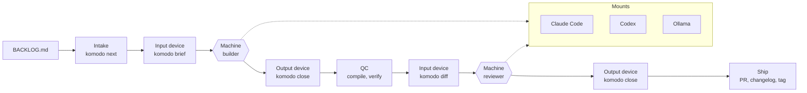

# komodo-agentic-factory-coding

Komodo's code assembly line. Work enters as tasks in `BACKLOG.md` and leaves as reviewed pull requests. The line is one static binary and a set of markdown files; the machines on it are whatever models you mount today. Swap a model and the line does not change. Swap the host and one mount changes.

**Status: V2 is planned, not built.** This README is the plan and the requirements. The repo was cleared to the markdown source on 2026-09-21; V1 lives at the tag `v1-final` and the branch `archive/v1`. Every task lands on PR #103 through six stacked group PRs, one per roadmap group. Tasks are in `BACKLOG.md`.

## The line



- **Conveyor.** Moves work between stations and never calls a model: intake, close, QC, ship. One binary, `komodo`. `komodo step` tells a session the one next action, so the station order exists only in the binary and no skill, rule, or agent can alter it.
- **Input device.** The brief. Task, repo rules, repo context, files, standards, done-when, failure. Identical bytes whatever machine reads it.
- **Output device.** The result JSON checked against the role's schema. A machine that returns bad output is rejected at the device and given one repair, never debugged in the line.
- **Machines.** Two on the line, builder and reviewer. The same roles serve ad hoc sessions off the line.
- **Mounts.** How a brief reaches a machine on a given host and how its result comes back. One per host, and the binary is its own mount for Ollama, so a local model is called mechanically and never through another model. A model swap is a profile row; a host swap is a mount.

### Stations

| Station | Command | Does |
|---|---|---|
| Intake | `komodo next` | Prints the next READY group, or one task, as JSON: waves by directory, dependencies, resolved machines. Creates the group branch in its own worktree from the remote base, so your working tree never blocks a run. Tags any untagged changelog version. Skips tasks with a valid result on disk, which is resume. |
| Brief | `komodo brief <task>` | Fills the role template from the slots, writes the brief and the worktree, prints their paths. `--dry-run` prints slot sizes and a token estimate. |
| Build | the run skill spawns the builder | Reads the brief path, owns the worktree, writes its result JSON. |
| Close | `komodo close <task>` | Validates the result, reruns `done_when`, lints comments, flips the status. A failure writes the failure slot for one repair; a second failure marks BLOCKED with the note and the wave continues. |
| QC | `komodo close --wave` | Merges the wave's worktrees in order, stops on conflict naming both tasks, runs the compile gate for the languages touched with one repair, then the repo's verify command. |
| Review | `komodo diff`, then the run skill spawns the reviewer, or `komodo machine` runs it on Ollama | The diff, the group's tasks, and the standards the diff touches. Fresh context, another tier or vendor when the profile says so. One pass, one repair. |
| Ship | `komodo close --group` | Commit, push, PR with the report as body and labels the repo already defines, draft when a task is blocked, changelog line under the group's version, status DONE. |
| Report | `komodo report` | Per task time, turns, tokens when the mount reports them, findings, what blocked. Accessibility format. |

Waves: tasks in disjoint directories run at once, each in its own worktree. `mode: single` is one builder for the group.

### Devices

Every brief slot has a cap and is clipped head and tail with a marker the model can see.

| Slot | Source | Cap |
|---|---|---|
| task block | the task's YAML | none |
| repo rules | the repo's `AGENTS.md`, or a one-line default | 8k chars |
| repo context | `.komodo/context/*.md` whose globs match the task's files | 8k chars |
| context | the task's `context` anchors, resolved to sections | 10k per file, 24k total |
| files | the task's `files`, existing ones read | 10k per file, 24k total |
| standards | by extension and role, shipped plus the repo layer | 6k per standard |
| done when | the task's commands | none |
| failure | the failed output and the previous attempt's diff, on repair only | 80k |

The reviewer's brief is the diff, the tasks, and the touched standards. The output device is `roles/<role>.schema.json`; close checks type, required, and enum, and rejects anything else.

## Metrics

Every station stamps a ledger line as it runs, with no model in the loop. Two files under `.komodo/`, gitignored, never sent anywhere, never committed, never in a PR body.

| File | Written by | Reset |
|---|---|---|
| `line.jsonl` | every station of a run: intake, brief, build, close, QC, review, ship | Truncated when `komodo next --start` begins a new run |
| `adhoc.jsonl` | any station run off the line, and every task a session crafts with `komodo add` | Truncated by its next writer when the first line is older than 24 hours or the file is over 1 MB |

A line carries the run, group, task, wave, station, role, tier, host, provider, model, seconds, tokens in and out, turns, outcome, and the failure class when there is one. Seconds come from timestamps the binary already holds. Tokens and turns come from the mount reading the host's own transcript or stream output after the fact; a host that exposes nothing gets an empty field, never a guess. Review findings come from the reviewer's result JSON, which it writes anyway.

`komodo report` reads the run's file. `komodo metrics` aggregates whatever the two files hold: median seconds per station, failure rate by class, tokens per task by model, repair rate, findings per group. Text, zero tokens. The run skill never reads either file, so telemetry costs the loop nothing. Freehand work that calls no `komodo` command is invisible to both files by design; the guard stays read-only.

## Machines and mounts

| Station | Input | Output | Claude Code mount | Codex mount | Ollama |
|---|---|---|---|---|---|
| Build | brief file | builder schema | subagent, model from the profile | TOML agent | native provider on Codex; a builder needs tools, so Claude Code keeps its own |
| Review | diff plus tasks | reviewer schema | subagent, other tier or vendor | TOML agent | `komodo machine`: the binary posts the brief and reads the JSON back |
| Ad hoc | rules and standards | none | agents and skills | agents and skills | `komodo machine` for any read-only role |

A role declares a tier, light, standard, or heavy, and never a model. A profile maps tiers to a provider, model, and effort for one host. Selection is automatic: the host from the mount installed, the plan from the probe, local tiers when Ollama answers. No flag for the default run.

| Profile | Host | light | standard | heavy | reviewer |
|---|---|---|---|---|---|
| `claude` | Claude Code | haiku | sonnet | opus | opus |
| `hybrid` | Claude Code with Ollama up | ollama | sonnet | opus | ollama |
| `codex` | Codex | small | standard | large | large |
| `local` | Codex with Ollama | local small | local coder | local coder | local coder |

A tier that resolves to `ollama` runs through `komodo machine` and carries only read-only roles. A write role on that tier falls back to the host's standard tier, and the report says so once. No model is ever spent to reach a local model.

Plan overlays sit on top: Pro lowers the heavy ceiling, caps parallel builders at two, skips review under a 40-line diff, and pauses at 75 percent of the five-hour window. Max keeps the defaults and pauses at 90 percent. Unknown is the conservative one. The probe reads the host's own config file, never a CLI status line that once misreported a Max account as Pro. Intake pauses before a wave, never inside one.

## Ad hoc work

The line is opt-in. The guard is always on.

1. **Off the line.** A session has the rules, standards, roles as agents, and skills from the same install, and does whatever you ask.
2. **Enter at any station.** `/review` runs QC and the reviewer on your diff. `/run TSK-03.2.4` runs one task through brief, build, close, review, ship. `komodo close --group` ships any branch you built by hand through verify, review, and a PR.
3. **Promote to the line.** Freehand work that turns out to be a feature becomes a task through the backlog skill, and the next `/run` picks it up.

Skills: `run` is three lines, call `komodo step`, do what it says, repeat, and takes a group, a task, or nothing; `review`; `backlog`; `respond` answers every unresolved PR thread as the responder role. These four cannot be appended to by a repo.

## The guard

One hook, on PreToolUse for shell, edit, and write, on every host. Everything else is a command a human or the run skill calls.

Denied, and nothing else:

1. **Critical branches.** Commit, push, merge, delete, or force on `main`, `master`, and any ref the policy lists. Greenfield repos protect nothing else.
2. **Paths outside the tasked worktree.** An edit, write, delete, or move that leaves the worktree root, or the repo root off the line.
3. **Host and toolkit config.** The home directories of the hosts, the machine overlay, the git config and hooks, and the toolkit's binaries.
4. **Trailers.** Co-author and generated-by lines in a commit.

Inside the worktree an agent has unlimited freedom: delete files, reset, checkout, force-push its own branch, delete its own branches. The rules file says the same. The guard fails open on an internal error and `komodo guard check` runs a 60-command table in the gate, so a broken guard fails the build and never a run. GitHub free has no branch protection, so the guard and the launcher's credential scrub are the only things between an agent and `main`. Merge is your button.

## The binary

`komodo` is one static Go binary: intake, brief, close, diff, report, lint, tag, release check, guard, install, doctor, machine, gate, run. Prebuilt for macOS arm64, Windows amd64, and Linux amd64 under `bin/` with a checksum manifest. Neither developer installs anything; there is no interpreter, no shell, no symlink, no build step on a dev machine. Whoever changes Go source rebuilds, and the pre-commit hook in this repo does it for them.

A Go binary is compiled per platform, so "any platform" means one small binary per target, not one file. Each is built with `CGO_ENABLED=0`, `-trimpath`, `-buildvcs=false`, and `-ldflags "-s -w"`, which makes a rebuild byte-identical and keeps each file near 3 MB. `.gitattributes` marks `bin/**` binary, the files slot names a binary by path and size and never reads it, and `komodo diff` skips binary paths, so no brief, review, or session ever spends a token on a binary. Repo size is accepted; token spend is not.

Go over Rust because 1013 lines of guard, hooks, and repo detection already exist, cross-compiling is two environment variables, and the process lives for milliseconds. Markdown stays markdown: rules, roles, skills, policy. Models never read Go.

## The gate

Every precheck runs locally and mechanically, before a commit and before a push, with no model and nothing on GitHub. GitHub Actions is not used: on a free account it bills minutes, fails on the runner instead of the desk, and adds a stage the line does not own.

`komodo gate` is the whole check: `go vet`, `go test`, doctor, `guard check`, and a rebuild of the three binaries compared to the manifest. The line runs it inside `close <task>` before the task commit and inside `close --group` before the push. In this repo `komodo gate --install` writes pre-commit and pre-push hooks that run the same command through the platform's binary, so a human terminal gets the same gate. Other repos rely on the guard and their own verify command; the git hooks are for the toolkit only.

## The repo layer

A repo may commit `.komodo/`. Nothing in it is required, a malformed file is skipped with one line in the report, and nothing in it widens what the guard denies.

- **`context/*.md`** with a `paths:` glob list: injected into any task whose files match.
- **`standards/<name>.md`**: appends to a shipped standard of that name, or adds a new one.
- **`skills/<name>/SKILL.md`**: a new skill, or a "Repo overrides" section appended to a shipped one. `komodo install --project` renders these into the host's project directory as gitignored copies.
- **`commands.json`**: verify, compile, before-review, after-publish, each a shell command the line runs at that station. Verify otherwise resolves by discovery: a Makefile target, a verify script, a package script, `go vet`.
- **`policy.json`**: adds critical refs. **`facets`**: names a facet detection missed. Precedence is defaults, then detection, then the machine overlay, then the repo, then the task, and each layer can only add.

## Detection and facets

The line adapts to a repo by detecting it, not by being told. `komodo detect` reads the tree once, zero tokens, and caches a profile under `.komodo/` keyed by a hash of the manifests it read: languages from extensions, cloud from markers such as a CDK config, a SAM template, a Terraform provider block, a Cloud Build file, or an Azure pipeline, data sources from a Prisma schema, SQL migrations, a dbt project, or compose services, CI from the workflows directory, and the verify and compile commands from the discovery order. An unknown tree is an empty profile, never a failed run.

A facet is what detection selects: a shipped directory under `komodo/facets/` with a skill, a builder appendix, a reviewer appendix, and default commands. The skill holds Komodo's own setup for that platform, and only what a model is not trained on: accounts, regions, naming, deploy paths, and conventions, never a vendor tutorial. Until a platform is set up, its skill says so and lists what is unknown. Shipped at launch: `aws`, `gcp`, `azure`, `postgres`, `github-actions`. A facet is injected at two points and edits nothing:

- **At the brief.** A ninth slot, the repo profile, about 200 characters. Facet appendices land in the standards slot under their own cap. A role's schema and tools never change.
- **At the project render.** `install --project`, which intake runs, writes the host's project config from the profile: the facet skills, the standards skills, the repo skills, the rules file. Gitignored copies, rebuilt every time, so a clone plus one command gives a developer the right tools without a commit.

A task may say `tier: heavy` to get the big model for one hard task, or `facets: [postgres]` to add one detection missed. A `.komodo/` file exists only to correct detection, and doctor fails when the cached profile or the rendered config has drifted from a fresh detection.

## Local machines

Ollama is mounted by the binary itself. `komodo machine <task>` posts the brief to Ollama's chat endpoint with the role's schema as the response format, writes the result JSON where close expects it, and stamps the ledger with the token counts the response carries. No host, no MCP, no other model in between: the call is mechanical and costs nothing but local compute. V1's HTTP server at 127.0.0.1:8000 is gone, and install removes its entry.

A local machine carries read-only roles: reviewer, summarizer, and any session role that only reads. So on Claude Code the `hybrid` profile builds with Claude and reviews on Ollama, and a review never shares a vendor with the build. A builder needs tools, which is the host's job, so a local builder needs a host that mounts Ollama natively: on Codex the `local` profile points every tier at Ollama through the host's provider setting. Both Komodo machines pull the same models.

## Hot swap

The line is fixed; everything a station consumes is swappable without touching the line. Each station resolves what it consumes at run time, from the layers, and `komodo step` prints what it resolved.

| Swap point | Where it is set | Reaches the station as |
|---|---|---|
| Machine | a profile row, per tier, per host | the mount that carries the brief |
| Skill | `komodo/skills/`, `.komodo/skills/`, a facet's skill | a slot in the brief, a file in the project render |
| External dependency: infra, data, CI | a facet, `.komodo/facets`, `commands.json` | the standards slot, the profile slot, the verify and compile commands |
| MCP | a facet's `mcp.json`, reserved | nothing in V2 |

MCPs are deferred. V2 gets the line working with models, skills, and external dependencies as the swappable parts; a later hot-swap pass renders a facet's MCP servers into the project config, and nothing else in the line will know an MCP exists. A role, a skill, and the binary hold no name of a model, a server, or a platform, so each of the four points is proven by a test that swaps it and watches the station change.

## The non-proprietary day

Both developers run Claude Code today. Nothing outside `internal/mount/` names a vendor, a host tool, a host path, or a host flag, and doctor fails on a leak. The exit test: install on a second host with zero changes outside the mounts, then run one group. Codex is the rehearsal; OpenCode or whatever wins later is a third mount. A Claude subscription covers only Anthropic's own apps, so any other host bills an API or runs locally.

## Roadmap

Six groups, all `2.0.0`, all on PR #103. Sessions build the first four; the run skill runs the last two as its own proof.

| Group | Delivers | Proof |
|---|---|---|
| TG-03.1 The markdown | Standards as skills, briefs folded into roles with schemas, the policy file with four denials, the rules updated for worktree freedom, the merger role removed | Tests, no old directories |
| TG-03.2 The conveyor and devices | The Go module and the binary: lint, next, brief, close, diff, report, tag, release check, the ledger and metrics, `step`; prebuilt binaries and the manifest | Every station has a test |
| TG-03.3 The guard and the mounts | The guard with the 60-command table, install for Claude Code and Codex, doctor with portability and prune, profiles with the plan probe and auto-selection | Guard table in the gate; validate under 1500 tokens |
| TG-03.4 The skills and the launcher | run, review, backlog, respond; `komodo run` headless with the scrub and a wall-clock budget; the V1 versus V2 timing proof | One group each way, numbers in the changelog |
| TG-03.5 The repo layer, detection, and local machines | Context by glob, repo standards and skills, commands and additive policy; `detect`, facets for AWS, GCP, Azure, Postgres, and GitHub Actions with Komodo's setup skills, the profile slot, the project render from the profile; the Ollama mount; the hybrid and local profiles | Tests, doctor, the Ollama mount against a fake Ollama |
| TG-03.6 The gate and the exit test | The local gate on pre-commit and pre-push with no CI; every swap point proven by test; one task under Codex with zero changes outside the mounts; README, names, and templates final; changelog 2.0.0 | Gate green locally, proofs recorded |

## Pull requests

PR #103 is the integration PR: its branch `docs/v2-plan` carries the plan and receives every group, and it merges into `main` once, at the end. Each roadmap group is one PR stacked on the group before it, so a group is reviewed against only its own diff and the line is exercised on real PRs before it ships. A group PR merges into its parent with a merge commit, so task commits survive; when a parent merges, GitHub retargets the next PR to `docs/v2-plan` on its own.

| PR | Branch | Base | Work | Opened by | Merges into |
|---|---|---|---|---|---|
| #103 | `docs/v2-plan` | `main` | The plan; the integration point | done | `main`, last, by the human; the tag `v2.0.0` is cut on merge |
| A | `refactor/v2-markdown` | `docs/v2-plan` | TG-03.1, 4 tasks: standards to skills, briefs to roles with schemas, the policy, the rules, the merger gone | a session | `docs/v2-plan` |
| B | `feat/v2-conveyor` | `refactor/v2-markdown` | TG-03.2, 8 tasks: the Go module, lint, the gate, next, brief, close, QC and ship, diff, report, tag, the ledger, step | a session | A |
| C | `feat/v2-guard-mounts` | `feat/v2-conveyor` | TG-03.3, 5 tasks: the guard, install for both hosts, doctor, self-selecting profiles, usage | a session | B |
| D | `feat/v2-skills-launcher` | `feat/v2-guard-mounts` | TG-03.4, 4 tasks: the four skills, the headless launcher, the proof task that PR E fills in, the edit-only permissions layer | a session | C |
| E | `feat/v2-repo-layer` | `feat/v2-skills-launcher` | TG-03.5, 9 tasks: repo context, standards, skills, commands, the Ollama mount, detect, facets, the profile slot, the project render | the line itself, through `/run TG-03.5` | D |
| F | `chore/v2-gate-exit` | `feat/v2-repo-layer` | TG-03.6, 6 tasks: the local gate hooks, names and README, the swap proofs, the Codex exit test, the changelog, the drift check | the line, plus the human for Codex | E |

How a stack moves:

1. **Cut.** `komodo next --start --base <parent>` cuts the group branch from the parent's head in its own worktree. Before B exists, a session cuts the branch by hand.
2. **Build.** Tasks land as one commit each on the group branch; the gate runs before every commit from B on.
3. **Open.** `close --group` opens the PR against the parent with the report as the body; before B exists, `gh pr create --base <parent>`.
4. **Validate.** The mechanical steps below pass on the desk, then the human steps; the reviewer role reads the diff cold from B on.
5. **Merge.** The human merges A first and walks down the stack; #103 merges last.

Validation per PR, mechanical first, then human. Nothing runs on GitHub.

| PR | Mechanical | Human |
|---|---|---|
| A | Every `done_when` of TG-03.1 exits zero. The V1 linter from a scratch worktree of `v1-final` reports zero problems. No file under `komodo/standards/`, `komodo/briefs/`, or `komodo/roles/merger.md`. Every role has a `.schema.json`. | Read `komodo/AGENTS.md` and `komodo/policy.json` end to end. The rules say worktree freedom and four denials, nothing V1. |
| B | `komodo gate` green: vet, test, byte-identical binaries. `komodo lint` on this backlog. `komodo next --json` prints TG-03.3 with its waves. `komodo brief --dry-run TSK-03.3.1` prints every slot under its cap. `komodo close` on a hand-written result JSON flips a status and stamps the ledger. `komodo step` prints one action. | Read one brief. It is the whole input a builder gets and nothing in it names a host. |
| C | `komodo gate` green with `guard check`: 60 commands, half allowed, each denial named. `komodo install --host claude --dry-run` lists the render and nothing outside the mounts names a host. `komodo doctor`: always-on context under 1500 tokens, no leak, no drift. The plan probe prints the overlay and never an email or an id. | Install on this Mac. In a session, an agent is denied a commit to `main` and allowed `rm` inside its worktree. |
| D | `komodo doctor`: the run skill under 800 tokens, four skills, none names a host. The launcher test proves the scrub: no push token, credential helper, or SSH identity reaches the child. `komodo run --dry-run TG-03.5` prints the host command it would launch. | `/run` in a session prints the first `step` action and stops when told. |
| E | Opened by `close --group`, body is the report. `komodo gate` green, `komodo doctor` green including profile drift. `komodo detect` on this repo prints Go and no cloud. The Ollama mount test passes against the fake, and `komodo machine` reviews one real diff on a local model. The swap of a facet by `.komodo/facets` reaches a brief. | The proof numbers for TSK-03.4.3 are in the changelog and the run was not slower than V1 by more than one wave. Read the PR body: it is a usable report. |
| F | `komodo gate` green as the pre-commit and pre-push hook on both developer machines. The retired-words grep finds nothing. The swap tests pass. `test ! -d .github/workflows`. | The Codex exit test ran with zero changes outside the mounts and its numbers are in the changelog. The README describes what exists. |
| #103 | A through F merged. `komodo gate` green on `docs/v2-plan`. `komodo release check` reports no drift for 2.0.0. | Both proofs in `CHANGELOG.md`. Merge, and the tag is cut. |

The repository ruleset must cover `main` only. Today it covers every branch and requires a pull request for any push, which the owner bypasses on each push and a collaborator cannot; scoping it to `main` is the one GitHub setting the plan needs.

## V1 coverage

Every V1 capability, where it lands, or why it does not.

| V1 capability | V2 |
|---|---|
| `run` with waves, worktrees, merge, verify, review, publish | next, brief, close, and the run skill, TG-03.2 and TG-03.4 |
| `run --dry-run` token estimates | `brief --dry-run`, TSK-03.2.3 |
| `run --resume` | Result files on disk, TSK-03.2.2 |
| `mode: single` groups | Honored by next, TSK-03.2.2 |
| Compile gate per wave with one repair | `close --wave`, TSK-03.2.5 |
| Verify command discovery order | Kept, overridable by repo commands, TSK-03.2.5 and TSK-03.5.3 |
| Blocked task with note, wave continues | close, TSK-03.2.4 |
| Review with severity floor, findings filed to the backlog | diff and close, TSK-03.2.5 |
| PR body sections, labels from the mapping, draft on block | `close --group`, TSK-03.2.5 |
| Changelog entry per version | `close --group`, TSK-03.2.5 |
| Preflight tag, `release check` | tag and release check, TSK-03.2.6 |
| Clean-tree check | Replaced: intake works in its own worktree from the remote base, TSK-03.2.2 |
| Report: phases, per-role cost, summary buckets | report and the ledger, TSK-03.2.6 and TSK-03.2.7; per-phase time becomes per-station time |
| Plan detection, model ceiling, turn caps | Plan probe and overlays, TSK-03.3.4; turn caps are the host's |
| Rate-window pause and warn | Intake waits before a wave, TSK-03.3.4 |
| Group wall-clock budget | The launcher, TSK-03.4.2 |
| `status --prune` and `--json` | `doctor --prune` and `--json`, TSK-03.3.3 |
| `tasks lint`, `list`, `add` | Kept, TSK-03.2.1 |
| `tasks plan` worker | The planner role through the backlog skill, TSK-03.4.1 |
| `tasks migrate` | Dropped; the pre-1.0 grammar has no repos left |
| `pr threads`, `label`, `comment`, `reply` | Kept inside the binary, TSK-03.4.1 |
| `pr respond` worker | The respond skill in a session, TSK-03.4.1 |
| `pr sync` worker and the merger role | Dropped; a conflict is the human's |
| `install` with seeds, `--dry-run`, copy on Windows | Kept, TSK-03.3.2; `--host` and `--project` added |
| `doctor`: references, policy leaks, leftovers, roles, changelog | Kept, TSK-03.3.3; portability and repo drift added |
| `comments check` | Kept inside close and as a command, TSK-03.2.4 |
| `hooks install`, pre-commit, pre-push | Kept for this repo only as `komodo gate --install`, mechanical and model-free; other repos rely on the guard, TSK-03.6.1 |
| Go guard and Go inject | The guard subcommand, TSK-03.3.1; inject dropped, the backlog skill reads the file |
| `gitops` refusals and the single pusher | The guard's four denials and the launcher's scrub, TSK-03.3.1 and TSK-03.4.2 |
| Destructive command patterns | Dropped; greenfield, no prod, no AWS; the guard denies paths outside the worktree instead |
| Scope by task file list | Replaced by the worktree boundary, TSK-03.3.1 |
| `worker_env` credential scrub | The launcher, TSK-03.4.2 |
| Brief slots with clip and caps | brief, TSK-03.2.3 |
| Standards by extension, clipped in briefs, pointers in sessions | TSK-03.1.1 and TSK-03.3.2 |
| Worker JSON validated against a schema | close, TSK-03.2.4 |
| Ollama worker and the summarizer | The Ollama mount and the hybrid profile, TSK-03.5.4 and TSK-03.5.5 |
| Profiles fast, thinking, local | claude, hybrid, codex, local, auto-selected, TSK-03.3.4 |
| Always-on token budget in validate | Kept inside doctor, TSK-03.3.3 |
| Verify gate | `komodo gate`, local, before every commit and push, TSK-03.2.1 and TSK-03.6.1 |
| Project templates | Kept, TSK-03.6.2; the host rules file is rendered by `install --project` |
| Personal overlay seed | Kept, TSK-03.3.2 |
| Per-worker dollar caps and timeouts | Dropped; a subscription never charges them and the host owns turns |
| Repo-level context, standards, exclusions | Built, TG-03.5; exclusions become the repo layer's additive rule |

## Names

One vocabulary, used the same way in this file, the backlog, the code, the skills, and every command and flag. V1's words for these parts are retired, and TSK-03.6.2 greps them out of everything a model or a developer reads.

| Name | Means |
|---|---|
| Station | One fixed step of the line, a `komodo` subcommand or a spawn |
| Device | The brief going in, the result JSON coming out |
| Machine | A model doing one station's work |
| Mount | The code that carries a brief to a machine on one host, or to Ollama |
| Profile | The table that maps tiers to machines for one host |
| Tier | light, standard, or heavy; what a role asks for, never a model |
| Role | One markdown file: what a machine is at a station or in a session |
| Skill | A markdown procedure a session or a brief can load |
| Facet | What detection selects for a platform: a skill, appendices, commands |
| Guard | The one agent hook, four denials |
| Gate | The local precheck before a commit and a push |
| Ledger | The two local metrics files |

## Setup

Requirements: git, `gh` authenticated, and the host CLI on PATH. Ollama is optional.

```bash
git clone <this repo> ~/komodo/ai/komodo-agentic-factory-coding
cd ~/komodo/ai/komodo-agentic-factory-coding
bin/komodo-darwin-arm64 install --host claude     # or the windows or linux binary; --host codex; --host both
```

The install is a copy. After editing anything under `komodo/`, run it again. `komodo doctor` says when you forgot. In this repo, `komodo gate --install` puts the gate on pre-commit and pre-push once.

## Usage

```bash
/run                        # in a session: the next ready group down the line
/run TG-03.5                # one group
/run TSK-03.5.2             # one task
/review                     # QC and the reviewer on the current diff
komodo run TG-03.5          # headless, credentials stripped
komodo next --json          # what would run, and why
komodo lint                 # after every backlog edit
komodo doctor               # references, portability, drift, prune
komodo gate                 # vet, test, doctor, guard table, binaries; pre-commit and pre-push run it here
```

## Layout

| Path | What |
|---|---|
| `komodo/AGENTS.md`, `komodo/rules/` | Universal rules, the accessibility contract, the backlog grammar |
| `komodo/roles/` | One file per role: tier, tools, session flag, schema, brief template |
| `komodo/skills/` | `run`, `review`, `backlog`, `respond`, and one `standards-<x>` per language or domain |
| `komodo/policy.json` | The four denials and the critical refs |
| `komodo/facets/` | One directory per platform: Komodo's setup skill, appendices, commands, markers |
| `cmd/komodo/`, `internal/` | The binary: line, guard, mounts including Ollama, gate, launcher |
| `bin/` | Prebuilt binaries and the manifest |
| `templates/project/` | Starters for a new repo |
