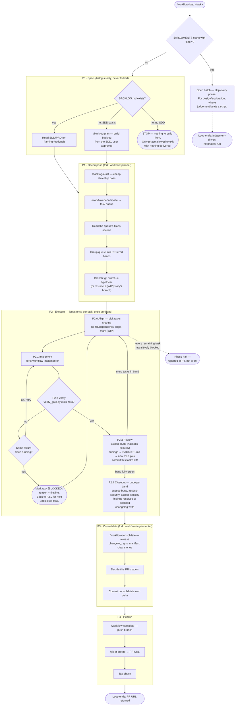

# komodo-agentic-toolkit-coding

Agent configuration for software/hardware engineering, shared across every Komodo project. `claude-code/` mirrors `~/.claude/` one-to-one and is symlinked there.

Four ideas hold it together:

1. **Rules that must never break are enforced by a hook, not by prompt text.** Comments and git are checked before the write, never after.
2. **Base context stays tiny.** ~1155 tokens of always-on rules and skill names; every skill body loads only when a path glob matches.
3. **Work state lives on disk, not in the conversation.** Five documents per repo mean a compaction cannot lose the plan.
4. **Nothing is Claude-specific except `settings.json`.** Rules and skills are plain markdown, so a local model behind the bridge reads the same source of truth.

## Setup

### macOS / Linux

```bash
bash setup.sh --dry-run    # preview
bash setup.sh              # link, then run the tests and validate
```

### Windows

```
python3 scripts/install.py --dry-run    # preview
python3 scripts/install.py              # link (or copy, if symlinks aren't available), then generate settings.json
```

Substitute `python` or `py -3` for `python3`, whichever resolves on your machine. See [docs/windows-install.md](docs/windows-install.md) for a full walkthrough — Python/Git prerequisites, enabling Developer Mode for real symlinks, and what to do if it falls back to copy mode instead.

Restart Claude Code afterwards so `settings.json` and the hooks take effect.

## Structure

```
claude-code/          mirrors ~/.claude exactly
├── AGENTS.md         the universal rules — always loaded
├── CLAUDE.md         @AGENTS.md
├── settings.json     permissions, hook registration, skillOverrides
├── agents/           workflow-implementer, workflow-planner, engineering, scout
├── hooks/            comments, git_guard, verify_gate, context_injector, auto_format
└── skills/           62 active, 6 parked, lazily loaded
templates/project/    AGENTS.md / CLAUDE.md / BACKLOG.md / CHANGELOG.md
bridges/komodo-bridge/    local LLM MCP bridge config
scripts/              validate.sh, test-hooks.sh, release.sh, portable git hooks
```

## The Agentic Workflow Loop

`/workflow-loop` is the default working mode for anything bigger than a one-line fix. Five phases: **spec → decompose → execute → consolidate → complete.**

The phases that read a lot and return a little run in a forked subagent, so their reading never lands in the main window. `/workflow-loop open <topic>` skips the machine for design work, where a script produces worse output than judgement.

**Template exception:** the `readme` skill mandates a fixed 6-section template (Overview, Features, Setup, Usage, Testing, References). This repo has no `docs/spec/SDD.md` of its own — it *is* the tool the rest of that template would otherwise point at — so every section below Setup departs from that skeleton by name, as a deliberate, one-off carve-out for this repo's shape: **Structure** (would be Features, but the directory tree is the more direct fact source than prose feature subsections), **The Agentic Workflow Loop** (Features/Usage content merged, including the diagram the template would otherwise push to an SDD that doesn't exist here), **The Hooks** (Features detail, kept adjacent to the loop it gates), **Skills** (Features detail, kept adjacent to the loop that invokes them), **Output Formatting** (has no template slot — states a session-level contract, not a repo feature), **Budget** (Testing-adjacent — it's a check `scripts/validate.sh` runs, but scoped to context budget rather than a test tier), and **Git hooks for other repos** (Usage detail — the one thing another repo actually invokes from this one).



Two escape routes exist outside the five-phase happy path: the **open hatch** (`open <topic>`) bypasses the machine entirely before P0 ever runs, and the **task-level `[BLOCKED]` exit** inside P2 lets one stuck task drop out — via two failed verify attempts on the same check — without halting the rest of the band; only every remaining task being transitively blocked halts P2 itself, and even then P4 still reports it rather than the run silently vanishing. P0's "nothing to build from" stop is the sole point allowed to end the whole loop with nothing delivered.

Each repo carries three local documents, plus the SDD (and, when one exists, the PRD) under `docs/spec/`. `readme` owns the entry point; `backlog-modify` and `changelog` own the format of the two mutable records (`backlog-audit` verdicts and edits `BACKLOG.md`'s existing tasks directly), with `standards-worklog` as the read/write directive shared across both. `sdd` and `prd` own authoring and audit for the spec files — `standards-specs` owns their section maps and read contract.

| File | Holds | Mutable |
|---|---|---|
| `README.md` | Entry point — what it is, how to run it | Yes, refreshed as it drifts |
| `BACKLOG.md` | Open work | Yes |
| `CHANGELOG.md` | What shipped, and the version | Append-only |

## The Hooks

One guard runs as `PreToolUse`, so a violation never reaches disk. Three more run at the session's edges or after the write.

| Hook | Fires on | Does | On error |
|---|---|---|---|
| `git_guard.py` | Bash | Allowlists read-only git, denies in-place rewrites | **Closed** |
| `verify_gate.py` | Stop | Blocks the turn while the repo's checks fail | **Open** |
| `context_injector.py` | SessionStart | Injects the current `[WIP]` story and version | **Open** |
| `auto_format.py` | Edit, Write (`PostToolUse`) | Runs `gofmt`/prettier on the written file; no-ops if the formatter isn't on `PATH` | **Open** |

**The failure policy is inverted on purpose.** The guard fails closed because a bad command reaches a shared remote. The other three fail open because none of them may be able to brick a session.

### Comments are a lint, not a hook

`comments.py` is a CLI, not a hook. `check` reports two finding kinds against changed lines — `MISSING` (a declaration that requires a comment and has none) and `INVALID` (a comment breaking a mechanical rule) — and `apply` splices proposals from the `write-comments` skill. Enforcement rides whatever already runs the repo's `verify` target.

```bash
python3 ~/.claude/hooks/comments.py check
python3 ~/.claude/hooks/comments.py apply < proposals.json
```

`MISSING` is Go-only and narrow: a multi-value return ending in `bool` (unless the name is `is`/`has`/`can`-prefixed), or three or more return values. Both suppress when a comment already sits above the declaration.

**There is no exemption sigil.** An earlier `+comments` grant was removed; nothing lifts the guard for a turn. Deleting a comment returns `ask`, and the guard fails closed on an unreadable payload.

```bash
bash scripts/test-hooks.sh    # 202 regression cases
```

## Skills

**The loader accepts exactly 19 frontmatter keys** — any other key silently rejects the whole file, so the skill simply does not exist at runtime. `validate.sh` fails the build on an unknown one.

| Kind | Frontmatter | Reaches the model | You type `/name` |
|---|---|---|---|
| Knowledge | `user-invocable: false` | Yes | No |
| Workflow | `disable-model-invocation: true` | No, costs zero context | Yes |
| Both | neither key | Yes | Yes |

**Activation is path-based.** A `paths:` glob makes the runtime load a skill when a matching file is touched; `skillOverrides` in `settings.json` then collapses it to `name-only` so its description costs nothing in the always-on listing. **`paths` decides when, `skillOverrides` decides cost.**

**There is no unload.** Once a body is in the window it stays until `/clear` or a compaction. Deferring the load is the whole lever — which is why a glob that is too broad is the expensive mistake, not a skill that exists.

Workflow skills, all free: `/adr` `/assess-bugs` `/assess-change-risk` `/assess-code-quality` `/assess-dependencies` `/assess-performance` `/assess-readiness` `/assess-security` `/assess-simplify` `/assess-testing` `/assess-vulnerabilities` `/backlog-audit` `/backlog-modify` `/backlog-plan` `/backlog-prioritize` `/changelog` `/config-accessibility` `/git-commit-message` `/git-commit-tag` `/git-issue-create` `/git-issue-review` `/git-pr-comment` `/git-pr-create` `/git-pr-review` `/prd` `/readme` `/readme-audit` `/repo-init` `/runbook` `/sdd` `/workflow-complete` `/workflow-consolidate` `/workflow-debug` `/workflow-decompose` `/workflow-implement` `/write-comments`

`/workflow-loop` carries neither key instead — it pays its description every turn so a plain-language request ("build this end to end") can trigger it, not just the typed command. Its forked phases stay slash-only on purpose.

**`context: fork` is the only way to reclaim context.** A skill declaring it runs its body *and* its work inside a subagent, returning only the result. The three workflow-loop phases use it. Pairing `argument-hint` with it requires `disable-model-invocation: true` — omit that and the skill is silently rejected.

## Output Formatting

The always-on contract lives in `claude-code/AGENTS.md` § 2 and applies to every turn. The full ADHD standard — turn-end summary schema, density caps, emoji protocol, code-answer order, document typography — lives in the `config-accessibility` skill and loads only when authoring something longer than a screen.

Every subagent carries the same contract as a mandatory output template.

## Budget

```bash
bash scripts/validate.sh
```

Verifies every symlink, validates every skill and agent against the loader's frontmatter schema, and **fails above 2,000 tokens** of base context.

A skill listed by name costs 1–4 tokens. A new line in `claude-code/AGENTS.md` costs its full length on every session, forever — put it in a skill unless it must always apply.

## Git hooks for other repos

**No comment hook ships here.** A comment must never block a commit, a push, or a release. `comments.py check` runs inside the repo's own `verify` target — by the time git sees a file, the dispute is already settled or was never the agent's to have.

**Lint and test hooks do not live here.** `pre-commit` (format + lint) and `pre-push` (delta unit tests + coverage) ship with the language SDK — `komodo-forge-sdk-go` for Go. The `standards-cicd` skill states the contract they must satisfy; the SDK decides how.

Install per repo:

```bash
bash scripts/hooks/git/install.sh /path/to/repo         # one repo
bash scripts/hooks/git/install.sh ~/komodo/*/*          # many repos, skips non-repos
bash scripts/hooks/git/install.sh --status /path/...    # report only, change nothing
```

`install.sh` sets `core.hooksPath` to its own directory's absolute path — nothing is copied, so editing a hook there takes effect in every installed repo on the next commit.
