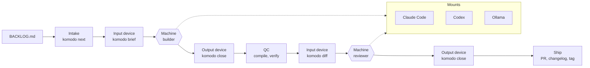

# komodo-agentic-toolkit-coding

Komodo's code assembly line. Work enters as tasks in `BACKLOG.md` and leaves as reviewed pull requests. The line is one static binary and a set of markdown files; the machines on it are whatever models you mount today. Swap a model and the line does not change. Swap the host and one mount changes.

**Status: V1.5 is planned, not built.** This README is the plan and the requirements. V1, the Python orchestrator under `komodo/`, runs today and builds the first three groups; the last group removes it. Tasks are in `BACKLOG.md`.

## The line



- **Conveyor.** Moves work between stations and never calls a model: intake, close, QC, ship. One binary, `komodo`.
- **Input device.** The brief. Task, repo rules, repo context, files, standards, done-when, failure. Identical bytes whatever machine reads it.
- **Output device.** The result JSON checked against the role's schema. A machine that returns bad output is rejected at the device and given one repair, never debugged in the line.
- **Machines.** Two on the line, builder and reviewer. The same roles serve ad hoc sessions off the line.
- **Mounts.** How a brief reaches a machine on a given host and how its result comes back. One per host. A model swap is a profile row; a host swap is a mount.

### Stations

| Station | Command | Does |
|---|---|---|
| Intake | `komodo next` | Prints the next READY group, or one task, as JSON: waves by directory, dependencies, resolved machines. Creates the group branch in its own worktree from the remote base, so your working tree never blocks a run. Tags any untagged changelog version. Skips tasks with a valid result on disk, which is resume. |
| Brief | `komodo brief <task>` | Fills the role template from the slots, writes the brief and the worktree, prints their paths. `--dry-run` prints slot sizes and a token estimate. |
| Build | the run skill spawns the builder | Reads the brief path, owns the worktree, writes its result JSON. |
| Close | `komodo close <task>` | Validates the result, reruns `done_when`, lints comments, flips the status. A failure writes the failure slot for one repair; a second failure marks BLOCKED with the note and the wave continues. |
| QC | `komodo close --wave` | Merges the wave's worktrees in order, stops on conflict naming both tasks, runs the compile gate for the languages touched with one repair, then the repo's verify command. |
| Review | `komodo diff`, then the run skill spawns the reviewer | The diff, the group's tasks, and the standards the diff touches. Fresh context, another tier or vendor when the profile says so. One pass, one repair. |
| Ship | `komodo close --group` | Commit, push, PR with the report as body and labels the repo already defines, draft when a task is blocked, changelog line under the group's version, status DONE. |
| Report | `komodo report` | Per task time, turns, tokens when the mount reports them, findings, what blocked. Accessibility format. |

Waves: tasks in disjoint directories run at once, each in its own worktree. `mode: single` is one builder for the group.

### Devices

Every brief slot has a cap and is clipped head and tail with a marker the model can see.

| Slot | Source | Cap |
|---|---|---|
| task block | the task's YAML | none |
| repo rules | the repo's `AGENTS.md`, or a one-line default | 8k chars |
| repo context | `.komodo/context/*.md` whose globs match the task's files | 8k chars |
| context | the task's `context` anchors, resolved to sections | 10k per file, 24k total |
| files | the task's `files`, existing ones read | 10k per file, 24k total |
| standards | by extension and role, shipped plus the repo layer | 6k per standard |
| done when | the task's commands | none |
| failure | the failed output and the previous attempt's diff, on repair only | 80k |

The reviewer's brief is the diff, the tasks, and the touched standards. The output device is `roles/<role>.schema.json`; close checks type, required, and enum, and rejects anything else.

## Machines and mounts

| Station | Input | Output | Claude Code mount | Codex mount | Ollama |
|---|---|---|---|---|---|
| Build | brief file | builder schema | subagent, model from the profile | TOML agent | bridge tool on Claude Code, native provider on Codex |
| Review | diff plus tasks | reviewer schema | subagent, other tier or vendor | TOML agent | same |
| Ad hoc | rules and standards | none | agents and skills | agents and skills | same |

A role declares a tier, light, standard, or heavy, and never a model. A profile maps tiers to a provider, model, and effort for one host. Selection is automatic: the host from the mount installed, the plan from the probe, local tiers when Ollama answers. No flag for the default run.

| Profile | Host | light | standard | heavy | reviewer |
|---|---|---|---|---|---|
| `claude` | Claude Code | haiku | sonnet | opus | opus |
| `hybrid` | Claude Code with Ollama up | bridge | sonnet | opus | opus, or bridge |
| `codex` | Codex | small | standard | large | large |
| `local` | Codex with Ollama | local small | local coder | local coder | local coder |

Plan overlays sit on top: Pro lowers the heavy ceiling, caps parallel builders at two, skips review under a 40-line diff, and pauses at 75 percent of the five-hour window. Max keeps the defaults and pauses at 90 percent. Unknown is the conservative one. The probe reads the host's own config file, never a CLI status line that once misreported a Max account as Pro. Intake pauses before a wave, never inside one.

## Ad hoc work

The line is opt-in. The guard is always on.

1. **Off the line.** A session has the rules, standards, roles as agents, and skills from the same install, and does whatever you ask.
2. **Enter at any station.** `/review` runs QC and the reviewer on your diff. `/run TSK-03.2.4` runs one task through brief, build, close, review, ship. `komodo close --group` ships any branch you built by hand through verify, review, and a PR.
3. **Promote to the line.** Freehand work that turns out to be a feature becomes a task through the backlog skill, and the next `/run` picks it up.

Skills: `run` takes a group, a task, or nothing; `review`; `backlog`; `respond` answers every unresolved PR thread as the responder role.

## The guard

One hook, on PreToolUse for shell, edit, and write, on every host. Everything else is a command a human or the run skill calls.

Denied, and nothing else:

1. **Critical branches.** Commit, push, merge, delete, or force on `main`, `master`, and any ref the policy lists. Greenfield repos protect nothing else.
2. **Paths outside the tasked worktree.** An edit, write, delete, or move that leaves the worktree root, or the repo root off the line.
3. **Host and toolkit config.** The home directories of the hosts, the machine overlay, the git config and hooks, and the toolkit's binaries.
4. **Trailers.** Co-author and generated-by lines in a commit.

Inside the worktree an agent has unlimited freedom: delete files, reset, checkout, force-push its own branch, delete its own branches. The rules file says the same. The guard fails open on an internal error and `komodo guard check` runs a 60-command table in the gate, so a broken guard fails the build and never a run. GitHub free has no branch protection, so the guard and the launcher's credential scrub are the only things between an agent and `main`. Merge is your button.

## The binary

`komodo` is one static Go binary: intake, brief, close, diff, report, lint, tag, release check, guard, install, doctor, bridge, run. Prebuilt for macOS arm64, Windows amd64, and Linux amd64 under `bin/` with a checksum manifest. Neither developer installs anything; there is no interpreter, no shell, no symlink, no build step on a dev machine. Whoever changes Go source rebuilds with `go build` and commits the binaries, and a CI check fails a PR whose binaries do not match a fresh build.

Go over Rust because 1013 lines of guard, hooks, and repo detection already exist, cross-compiling is two environment variables, and the process lives for milliseconds. Markdown stays markdown: rules, roles, skills, policy. Models never read Go.

## The repo layer

A repo may commit `.komodo/`. Nothing in it is required, a malformed file is skipped with one line in the report, and nothing in it widens what the guard denies.

- **`context/*.md`** with a `paths:` glob list: injected into any task whose files match.
- **`standards/<name>.md`**: appends to a shipped standard of that name, or adds a new one.
- **`skills/<name>/SKILL.md`**: a new skill, or a "Repo overrides" section appended to a shipped one. `komodo install --project` renders these into the host's project directory as gitignored copies.
- **`commands.json`**: verify, compile, before-review, after-publish, each a shell command the line runs at that station. Verify otherwise resolves by discovery: a Makefile target, a verify script, a package script, `go vet`.
- **`policy.json`**: adds critical refs. Precedence is defaults, then the machine overlay, then the repo, and each layer can only add.

## Local machines

`komodo bridge` is a stdio MCP server over Ollama, spawned by the host on demand, so there is no process to keep alive. On Claude Code a light role's body calls it, and the reviewer may too, so a review never shares a vendor with the build. On Codex the `local` profile points every tier at Ollama through the host's provider setting. Both Komodo machines pull the same models.

## The non-proprietary day

Both developers run Claude Code today. Nothing outside `internal/mount/` names a vendor, a host tool, a host path, or a host flag, and doctor fails on a leak. The exit test: install on a second host with zero changes outside the mounts, then run one group. Codex is the rehearsal; OpenCode or whatever wins later is a third mount. A Claude subscription covers only Anthropic's own apps, so any other host bills an API or runs locally.

## Roadmap

Six groups, all `1.5.0`. V1 runs the first three; the run skill runs the rest.

| Group | Delivers | Proof |
|---|---|---|
| TG-03.1 The markdown | Standards as skills, briefs folded into roles with schemas, the policy file with four denials, the rules updated for worktree freedom, the merger role removed | Tests, no old directories |
| TG-03.2 The conveyor and devices | The Go module and the binary: lint, next, brief, close, diff, report, tag, release check; prebuilt binaries and the manifest; the gate runs Go tests | Every station has a test |
| TG-03.3 The guard and the mounts | The guard with the 60-command table, install for Claude Code and Codex, doctor with portability and prune, profiles with the plan probe and auto-selection | Guard table in the gate; validate under 1500 tokens |
| TG-03.4 The skills and the launcher | run, review, backlog, respond; `komodo run` headless with the scrub and a wall-clock budget; the V1 versus V1.5 timing proof | One group each way, numbers in the changelog |
| TG-03.5 The repo layer and local machines | Context by glob, repo standards, repo skills with `install --project`, commands and additive policy; the bridge; the hybrid and local profiles | Tests, doctor, bridge against a fake Ollama |
| TG-03.6 Demolition and the exit test | Python deleted, `go test` is the gate, one group under Codex with zero changes outside the mounts, README and templates final, changelog 1.5.0 | Verify passes with nothing left |

## V1 coverage

Every V1 capability, where it lands, or why it does not.

| V1 capability | V1.5 |
|---|---|
| `run` with waves, worktrees, merge, verify, review, publish | next, brief, close, and the run skill, TG-03.2 and TG-03.4 |
| `run --dry-run` token estimates | `brief --dry-run`, TSK-03.2.3 |
| `run --resume` | Result files on disk, TSK-03.2.2 |
| `mode: single` groups | Honored by next, TSK-03.2.2 |
| Compile gate per wave with one repair | `close --wave`, TSK-03.2.5 |
| Verify command discovery order | Kept, overridable by repo commands, TSK-03.2.5 and TSK-03.5.3 |
| Blocked task with note, wave continues | close, TSK-03.2.4 |
| Review with severity floor, findings filed to the backlog | diff and close, TSK-03.2.5 |
| PR body sections, labels from the mapping, draft on block | `close --group`, TSK-03.2.5 |
| Changelog entry per version | `close --group`, TSK-03.2.5 |
| Preflight tag, `release check` | tag and release check, TSK-03.2.6 |
| Clean-tree check | Replaced: intake works in its own worktree from the remote base, TSK-03.2.2 |
| Report: phases, per-role cost, summary buckets | report, TSK-03.2.6; per-phase time becomes per-task time |
| Plan detection, model ceiling, turn caps | Plan probe and overlays, TSK-03.3.4; turn caps are the host's |
| Rate-window pause and warn | Intake waits before a wave, TSK-03.3.4 |
| Group wall-clock budget | The launcher, TSK-03.4.2 |
| `status --prune` and `--json` | `doctor --prune` and `--json`, TSK-03.3.3 |
| `tasks lint`, `list`, `add` | Kept, TSK-03.2.1 |
| `tasks plan` worker | The planner role through the backlog skill, TSK-03.4.1 |
| `tasks migrate` | Dropped; the pre-1.0 grammar has no repos left |
| `pr threads`, `label`, `comment`, `reply` | Kept inside the binary, TSK-03.4.1 |
| `pr respond` worker | The respond skill in a session, TSK-03.4.1 |
| `pr sync` worker and the merger role | Dropped; a conflict is the human's |
| `install` with seeds, `--dry-run`, copy on Windows | Kept, TSK-03.3.2; `--host` and `--project` added |
| `doctor`: references, policy leaks, leftovers, roles, changelog | Kept, TSK-03.3.3; portability and repo drift added |
| `comments check` | Kept inside close and as a command, TSK-03.2.4 |
| `hooks install`, pre-commit, pre-push | Dropped; the guard covers every agent and a human terminal is the human's |
| Go guard and Go inject | The guard subcommand, TSK-03.3.1; inject dropped, the backlog skill reads the file |
| `gitops` refusals and the single pusher | The guard's four denials and the launcher's scrub, TSK-03.3.1 and TSK-03.4.2 |
| Destructive command patterns | Dropped; greenfield, no prod, no AWS; the guard denies paths outside the worktree instead |
| Scope by task file list | Replaced by the worktree boundary, TSK-03.3.1 |
| `worker_env` credential scrub | The launcher, TSK-03.4.2 |
| Brief slots with clip and caps | brief, TSK-03.2.3 |
| Standards by extension, clipped in briefs, pointers in sessions | TSK-03.1.1 and TSK-03.3.2 |
| Worker JSON validated against a schema | close, TSK-03.2.4 |
| Ollama worker and the summarizer | The bridge and the hybrid profile, TSK-03.5.4 and TSK-03.5.5 |
| Profiles fast, thinking, local | claude, hybrid, codex, local, auto-selected, TSK-03.3.4 |
| Always-on token budget in validate | Kept inside doctor, TSK-03.3.3 |
| Verify gate | `go test`, doctor, and the guard table, TSK-03.2.1 and TSK-03.6.1 |
| Project templates | Kept, TSK-03.6.2; the host rules file is rendered by `install --project` |
| Personal overlay seed | Kept, TSK-03.3.2 |
| Per-worker dollar caps and timeouts | Dropped; a subscription never charges them and the host owns turns |
| Repo-level context, standards, exclusions | Built, TG-03.5; exclusions become the repo layer's additive rule |

## Setup

Requirements: git, `gh` authenticated, and the host CLI on PATH. Ollama is optional.

```bash
git clone <this repo> ~/komodo/ai/komodo-agentic-toolkit-coding
cd ~/komodo/ai/komodo-agentic-toolkit-coding
bin/komodo-darwin-arm64 install --host claude     # or the windows or linux binary; --host codex; --host both
```

The install is a copy. After editing anything under `komodo/`, run it again. `komodo doctor` says when you forgot.

## Usage

```bash
/run                        # in a session: the next ready group down the line
/run TG-03.5                # one group
/run TSK-03.5.2             # one task
/review                     # QC and the reviewer on the current diff
komodo run TG-03.5          # headless, credentials stripped
komodo next --json          # what would run, and why
komodo lint                 # after every backlog edit
komodo doctor               # references, portability, drift, prune
go test ./...               # the gate, in this repo
```

## Layout

| Path | What |
|---|---|
| `komodo/AGENTS.md`, `komodo/rules/` | Universal rules, the accessibility contract, the backlog grammar |
| `komodo/roles/` | One file per role: tier, tools, session flag, schema, brief template |
| `komodo/skills/` | `run`, `review`, `backlog`, `respond`, and one `standards-<x>` per language or domain |
| `komodo/policy.json` | The four denials and the critical refs |
| `cmd/komodo/`, `internal/` | The binary: line, guard, mounts, bridge, launcher |
| `bin/` | Prebuilt binaries and the manifest |
| `templates/project/` | Starters for a new repo |
