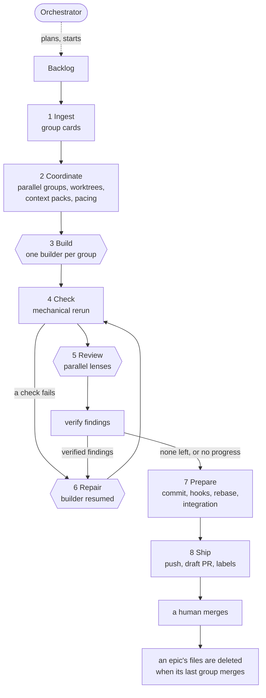
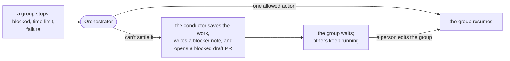

# Architecture — komodo-agentic-factory-coding

The parts and how they connect: small enough for a planner and a reviewer to read whole. Names and reasons only; a flag, field, or version belongs in `system-design.md`, and a number in `prd.md`. Every heading here exists in exactly one spec file, so a task cites one place.

**Status:** Accepted, 2026-09-25, for 1.0.0. It describes the target that decisions 0001 to 0023 set; `decisions.md` holds why.

## Purpose

Komodo bolts onto Claude Code as rules, skills, configuration and compiled binaries. It is two products in one install:

- **A session harness.** Every Claude Code session a developer opens gains the orchestrator: the guard, the line's commands, and the skills to plan, run and watch work.
- **A code factory.** The assembly line turns task groups into reviewed, draft-first pull requests, the same way on every machine.

Five principles shape it:

1. **The more mechanical, the better.** Anything a program can decide, the binary decides. A model gets one job, one brief, a tool list and a time limit.
2. **Police the output, not the input.** Predicting every harmful command is impossible. Checking the resulting worktree, refs and diff is simple and complete.
3. **Scoped, pinned and hermetic.** Each role loads only its own skills, tools and hooks, on the same pinned versions on every machine.
4. **Every loop ends on its own.** A loop continues only while it makes progress, and every group has a time limit. What can't be settled stops, is written down, and waits for a person.
5. **A number decides readiness.** `komodo eval` runs pinned task groups in real repos. No model rates the line.

## Context

| Who or what | Part it plays |
|---|---|
| Human engineers | Talk to the orchestrator, plan work, settle groups the line stopped, review and merge pull requests |
| Autonomous jobs | Start runs unattended, the way an engineer would |
| Claude Code | The host: runs the primary session and every model session |
| The forge | Holds `main` and receives the pushes and draft pull requests Ship makes |
| The OS sandbox | Confines line sessions on macOS, Linux and WSL2 |
| Target repos | The product repos, and this repo itself, that the line builds in |
| Plugins | Later: chat notifiers and cloud tool packs, installed disabled |

## Components

| Component | Responsibility | Runs where |
|---|---|---|
| Orchestrator | The person's single interface: plans work, starts and watches runs, answers questions, injects groups, runs single stages ad hoc, and settles escalations | The primary Claude Code session, with the global layer |
| Conductor | Runs the stages, spawns and resumes sessions, enforces limits, runs every check and all git work, paces to the plan, and stops what can't be settled | The `komodo` binary |
| Builder | Works one task group's task list, then repairs from a fix list | A headless session in the group's worktree |
| Review lenses | Judge one group's diff against its task list, each through one lens, with evidence | Headless read-only sessions, run in parallel |
| Validators | Measure what a model would otherwise guess: lint, security scans, caller counts, tests | Commands the conductor runs |
| Guard | Catches common mistakes on model tool calls | A hook in every session |
| Host mount | Carries a brief to one host's sessions through the host contract | Inside the binary, one per host |
| Profiles | Map each role to a model and effort, per plan | Files the conductor reads |
| Backlog | The committed plan: one file per task group, ticked as work completes, with blockers written down | `docs/backlog/`, in the repo |
| Run state and ledger | Each group's stage and sessions, and every stage's time and tokens | `.komodo/` on each machine |
| Plugins | Notifiers, tool packs and stage hooks | Installed disabled; enabled per machine |

The stages the conductor runs:

| # | Stage | Run by | Model |
|---|---|---|---|
| 1 | Ingest | Conductor | none |
| 2 | Coordinate | Conductor, with the orchestrator on escalations | none on the normal path |
| 3 | Build | Builder | builder |
| 4 | Check | Conductor | none |
| 5 | Review | Review lenses, checked by validators | reviewer |
| 6 | Repair | Builder, resumed | builder |
| 7 | Prepare | Conductor | none |
| 8 | Ship | Conductor | none |

## Boundaries

- **Inside:** the `komodo` binary, the markdown each role reads (rules, roles, skills, checklists, policy), the global orchestrator layer, and one host mount.
- **Depends on:** Claude Code at a pinned version, the OS sandbox where the platform has one, the forge, and each developer's own host login and git credential.
- **Never:** a model routing stages, holding a forge credential, switching branches, or changing `main`.

The threat model is a cooperative model that makes mistakes. An adversarial model is out of scope for the guard and in scope only for the layers that hold without its cooperation.

| Layer | Stops | Held by |
|---|---|---|
| Human merge | Anything reaching `main` unreviewed | A person; a forge ruleset too, where the forge offers one |
| Draft-first pull requests | Unverified work looking ready | Ship |
| Credential isolation | An agent pushing anything | Only the conductor reads the git credential, and only at Ship |
| OS sandbox | Writes outside the worktree, network beyond the allowlist, reads of credential files | The operating system, on macOS, Linux and WSL2 |
| Role scoping | Tools, skills and commands a role does not need | Each role's own config, tool list and allow list |
| Output checks | Edits outside the group's files, model commits, changed refs, hooks or git config | The conductor, comparing before and after |
| The guard | Common mistakes on model tool calls | One hook; fails open |

Native Windows has no OS sandbox, so there the other layers carry the load. `system-design.md#security` lists what the guard does not stop.

## Data flow

Double-bordered nodes are model sessions. Everything else is the conductor with no model.

When something stops a group, the orchestrator gets the first chance to settle it:

## Glossary

Terms in the Names table of `README.md` keep that meaning. This design adds:

| Term | Means |
|---|---|
| Task group | 1 to 12 related tasks, like one engineering story; one builder, one review, one pull request |
| Task list | The group's tasks as checkboxes: the builder's brief and the reviewer's yardstick |
| Backlog | The committed plan: one file per task group, deleted when its epic ends; `CHANGELOG.md` keeps the history |
| Card | A task group compiled by ingest: its task list, files, checks, context and size |
| Conductor | The `komodo` binary running the line |
| Orchestrator | The primary session: the person's interface to the line |
| Host contract | What a host mount must do: preflight, start, resume, stream, return a result, stop |
| Lens | One review angle, run as its own session: correctness, security and readiness, or quality |
| Fix list | The repair task list built from verified findings or failed checks |
| Escalation | A stop the conductor can't settle alone: a blocked builder, a time limit, a failure |
| Blocker note | What the conductor writes into a group's backlog file, on its branch, when the orchestrator can't settle an escalation; published as a draft PR labelled `status: blocked` |
| Bound and unbound | Paced to a subscription's usage windows, or to a spend budget on API billing |
| Economy mode | The cheaper profile and single review lens used on a Pro plan |
| Golden group | A real merged change rewound to its parent, its own tests hidden from the builder |
| Consistency | The share of golden groups with the same outcome in every run, and on every platform |
