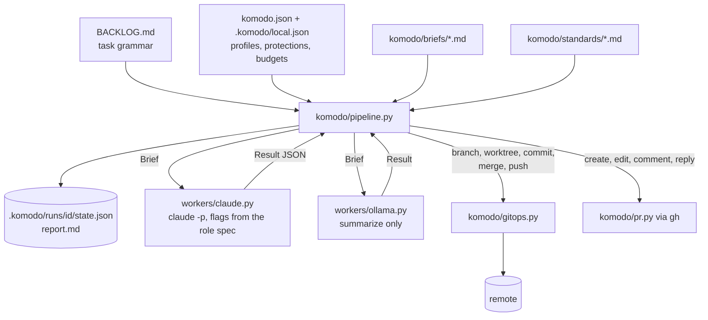

# Architecture

## The shape

The orchestrator is the only component with state and the only one that touches git. A worker receives a `Brief` and returns a `Result`. Every phase writes `state.json` so `--resume` picks up where a run stopped.

## Phases

| Phase | Input | Output | Fails how |
|---|---|---|---|
| preflight | backlog, config, tree | group, waves, state | `PipelineError` before anything moves |
| branch | state | run branch checked out | `GitRefused` on a bad or protected name |
| build | waves | one commit per task on the run branch | a task blocks itself and its dependents; the run continues |
| compile gate | run branch after each wave | pass, or one repair | later waves skipped, group reported blocked |
| verify | run branch | pass, or one repair | no PR; branch left local |
| review | group diff | findings fixed or filed | findings all filed; run continues |
| publish | state | backlog statuses, changelog, push, PR | notes in the report |
| report | state | `report.md`, terminal summary | never |

## Waves

A task declares `files`. Its ownership unit is the set of directories those files live in. Two tasks share a wave when their directories are disjoint and every dependency of each is already done. `mode: single` on a group collapses this to one builder, one worktree, one commit.

Each task in a wave gets its own worktree on a branch cut from the run branch. Builders run in a thread pool up to `max_parallel`. When the wave finishes, the orchestrator merges each task's branch into the run branch in wave order, then removes the worktree and its branch. A conflict here blocks the task; disjoint directories make it rare.

## Briefs and context

A brief is the role's body plus its `## Worker output` contract as the system prompt, and `komodo/briefs/<role>.prompt.md` as the prompt, with every `{{slot}}` filled or the render refuses. The builder's slots:

| Slot | Source | Cap |
|---|---|---|
| `task_block` | the task's yaml | none |
| `repo_rules` | the repo's `AGENTS.md` | 6k chars |
| `context` | each `context:` path, one `#anchor` section when given | 8k per ref |
| `files` | each listed file's contents from the worktree | 24k total |
| `standards` | one file per language and domain the files touch | 6k each |
| `done_when` | the task's commands | none |
| `failure` | previous attempt's failing command and output | 12k |

`--dry-run` renders every brief and prints a token estimate per section without spawning anything.

## Workers

`workers/claude.py` builds one `claude -p` command per brief. The prompt travels on stdin. Flags come from the role spec: `--model`, `--effort`, `--max-turns`, `--max-budget-usd`, `--tools`, `--json-schema`. `--setting-sources project` keeps the user's global config out of the worker; `--strict-mcp-config` keeps MCP servers out; `--no-session-persistence` leaves nothing on disk. The result envelope's `structured_output`, `total_cost_usd`, `usage`, and `num_turns` feed the report.

`workers/ollama.py` posts to a local server's generate endpoint. It has no tool loop, so it only summarizes. Unreachable is a soft failure.

Adding a provider is one file implementing `Worker.invoke`. Adding a tool's config layout is one adapter module implementing `render`.

## Credentials

`gitops.worker_env()` produces the environment every worker runs in: `GH_TOKEN` and `GITHUB_TOKEN` removed, `credential.helper` set empty through `GIT_CONFIG_*`, `GIT_TERMINAL_PROMPT=0`, `GIT_SSH_COMMAND` in batch mode with no identity, `GH_CONFIG_DIR` pointed at an empty directory so `gh` is unauthenticated. A worker can commit inside its worktree if it ignores its brief; it cannot push.

`gitops.Git` refuses in code: a commit on a protected branch, a message with a co-author or generated-by trailer, a push to a protected ref, any refspec with `+` or `:`, a merge into a protected branch, a deletion of a protected branch.

## Review

One reviewer pass over `git diff base...HEAD` with the bug, security, test-gap, simplify, narrative-comment, and undocumented-nonobvious classes in one brief. Findings at or above `severity_floor` become one repair brief; the rest are appended to `BACKLOG.md` as `[TODO]` tasks with the finding's file and the repo verify command as `done_when`. `fast` skips review under `min_diff_lines`.

The pass also returns a blast-radius tier from `low` to `critical`: what the diff could break, scored separately from whether it already has a defect, so a wide change with no findings still scores high. Above `low-med` the reviewer runs the internal-dependency command the language standard names and reports what imports the changed files, or says the fan-out was judged rather than walked. The tier and its driving factor go into `report.md` and the PR body.

## One source, many adapters

`komodo/rules/` holds the universal rules and the two procedure documents. `komodo/roles/` holds one file per role: a frontmatter with `tier`, `access`, and `session`, then a body, then a `## Worker output` contract and a `## Session output` contract. The worker system prompt is body plus worker output; an interactive agent is body plus session output. Model and effort never appear in a role; the active profile's tier supplies them.

`komodo/adapters/claude/` renders that source into the `~/.claude` layout: `AGENTS.md`, `agents/<role>.md` for session roles, `skills/komodo` and `skills/backlog` from the rules documents, `skills/review` from the reviewer role, one pointer skill per standard, the two hooks, the standards copy, and a settings policy whose `skillOverrides` are derived from the rendered skill set. `scripts/validate.py` renders into a scratch directory and measures the always-on budget there. A second tool gets a second adapter with the same inputs.

The `local` profile points every tier at Ollama. Today that serves summarizing and, with a capable model, review; building needs a local runtime with a tool loop, which is the next adapter to write.

## Fragments

Three checks run inside `scripts/verify.py` through `komodo doctor`: a backticked repo path or a `/skill` name that no longer resolves, a personal preference key in `settings.policy.json` or a hook command naming a missing file, and skill frontmatter drift. `komodo status --prune` removes worktrees the harness left and deletes local branches whose PR merged.

## What would change these decisions

- **A GitHub plan with branch protection** would make the pre-push hook and the guard redundant for the remote, and would let `pr sync` land through the API.
- **A provider with a tool loop other than Claude** would make Ollama or another CLI a builder, not just a summarizer.
- **A group that regularly exceeds an hour** argues for smaller groups in the backlog, not a longer budget; the report's phase table shows where the time went.
- **A repo whose `scripts/` cannot hold `verify.py`** argues for a `.claude/verify.py` override, which the gate resolution already checks first.
